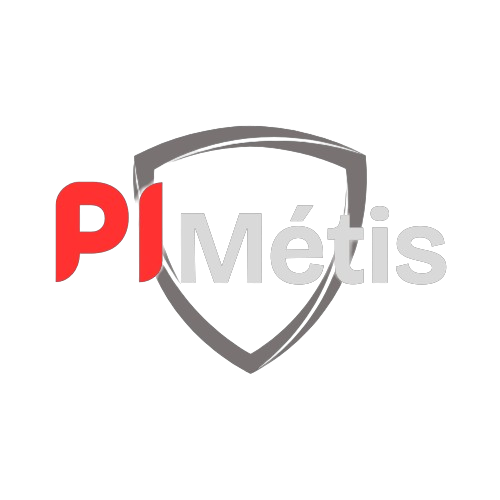

<br/>
<div align="center">
<a href="https://github.com/yabamiah/PiMetis">

</a>
<h3 align="center">PiMetis</h3>
<p align="center">
Um sistema embarcado de babá eletrônico com visão computacional

<br/>
<br/>

<a href="https://github.com/yabamiah/PiMetis/issues/new?labels=bug&template=bug-report---.md">Reportar Bug</a>
<a href="https://github.com/yabamiah/PiMetis/issues/new?labels=enhancement&template=feature-request---.md">Solicitar Recurso</a>
</p>
</div>

## Sobre o Projeto


PiMetis é um projeto acadêmico, desenvolvido para o projeto final da matéria [Sistemas Operacionais Embarcados](https://github.com/DiogoCaetanoGarcia/Sistemas_Embarcados) da Universidade de Brasília, ministrado pelo professor Diogo Caetano Garcia.

PiMetis é um sistema visão computacional aplicado em sistema embarcado, mais especificamente na Raspberry Pi 3, cujo o objetivo é monitorar um cômodo da casa onde deseja monitorar situações inesperadas. Sendo detectado alguma dessas situações abaixo, o sistema notificará o usuário pelo Telegram. 

- Quantidade de pessoas não esperadas em um cômodo da casa;
- Presença de objetos perigosos em um cômodo da casa;

O objetivo deste projeto é construir um sistema embarcado com alto processamento de dados e recursos computacionais para ser utilizado em um ambiente limitado, utilizando de recursos do sistema operacional para o seu desenvolvimento.

### Construído Com

O PiMetis foi construído utilizando essas ferramentas e tecnologias:

- [C++](https://isocpp.org/)
- [OpenCV](https://opencv.org/)
- [Gtkmm](https://www.gtkmm.org/en/index.html)
- [CPR](https://docs.libcpr.org/)
- [JSON for Modern C++](https://github.com/nlohmann/json)
- [YOLOv4](https://github.com/kiyoshiiriemon/yolov4_darknet)
- [cpp-httplib](https://github.com/yhirose/cpp-httplib)
- [Linux](https://github.com/torvalds/linux)
- [Cmake](https://cmake.org/)
- [Raspberry Pi OS](https://www.raspberrypi.com/software/operating-systems/)

## Começando

Para conseguir utilizar este sistema, siga os exemplos de instruções abaixo. Deixando claro que este é um projeto desenvolvido e surportado para o sistema **Linux**.

### Pré-requisitos

Para rodar este projeto é necessário instalar os seguintes pré-requisitos:

- g++
- cmake
- libcurl4-openssl-dev
- libopencv-dev
- ngrok
- curl
- git


  ```sh
  sudo apt install g++ cmake libcurl4-openssl-dev libopencv-dev ngrok curl git
  ```

### Compilação

Siga as instruções abaixo para compilar e gerar o executável do sistema.

1. Clone o repositório
   ```sh
   git clone https://github.com/yabamiah/PiMetis
   ```
3. Instale as bibliotecas pelo script do pimetis_setup
   ```sh
    sudo chmod +x pimetis_setup.sh
    ./pimetis_setup.sh
   ```
4. Compile o sistema
   ```sh
   cd source
   mkdir build && cd build
   cmake .
   make
   ```

## Uso

Para utilizar o sistema, é necessário apenas executar o binário e utilizá-lo através de sua interface gráfica.

## Roteiro

Para visualizar o roteiro do desenvolvimento do sistema, publicamos os relatórios do ponto de controle onde contém informações mais detalhadas da construção do PiMetis, desde o seu conceito incial, até a entrega da sua versão final. Os relatório podem ser visualizados [aqui](https://github.com/yabamiah/PiMetis/tree/main/report).

## Contribuindo

Contribuições são o que tornam a comunidade de código aberto um lugar tão incrível para aprender, inspirar e criar. Qualquer contribuição que você fizer será **muito apreciada**.

Se você tiver uma sugestão que tornaria isso melhor, faça um fork do repositório e crie um pull request. Você também pode simplesmente abrir um issue com a tag "enhancement".
Não se esqueça de dar uma estrela ao projeto! Obrigado novamente!

1. Faça um fork do Projeto
2. Crie seu Branch de Recurso (`git checkout -b feature/AmazingFeature`)
3. Commit suas Mudanças (`git commit -m 'Add some AmazingFeature'`)
4. Push para o Branch (`git push origin feature/AmazingFeature`)
5. Abra um Pull Request

## Licença

Distribuído sob a Licença MIT. Veja [Licença MIT](https://opensource.org/licenses/MIT) para mais informações.
